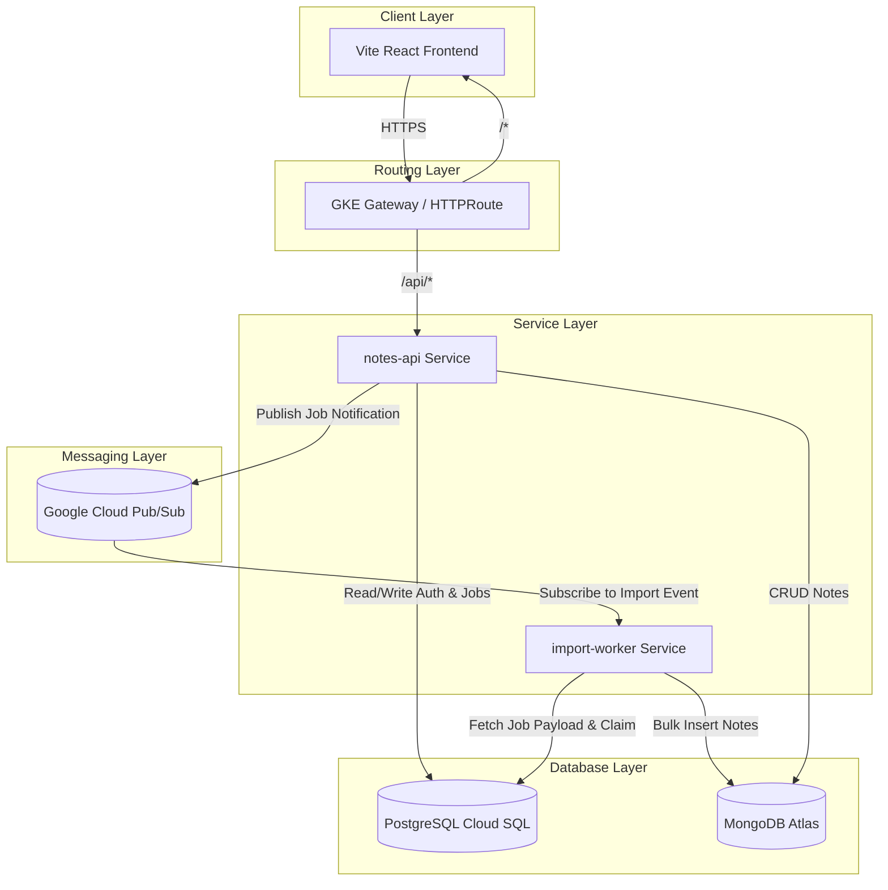

# Architecture Design

This document details the architectural decisions, design patterns, and system topology of **CloudNotes**.

---

## 1. System Topology

CloudNotes is structured as a decoupled, microservice-based architecture designed for containerized deployment on Google Kubernetes Engine (GKE).



---

## 2. Key Design Patterns

### A. Asynchronous Ingest (API-Worker Decoupling)
To handle high-volume bulk note imports without blocking API HTTP threads, we employ an asynchronous ingestion pattern:
1. **Intake**: When a user uploads a bulk list of notes, the `notes-api` validates the request payload and writes it directly to PostgreSQL as an `ImportJob` parent record and a set of `ImportJobItem` child records.
2. **Decongestion**: Rather than serializing the entire note array over a messaging queue (which could exceed broker payload limits), the API publishes a lightweight `ImportRequestedEvent` containing only the `jobId` and the `userId`.
3. **Decoupled Processing**: The event is pushed to Google Cloud Pub/Sub. The `import-worker` consumes the event asynchronously and performs the bulk write directly to MongoDB.

### B. Idempotent Consumer Pattern
To guarantee data consistency under network-driven message redeliveries or failures:
1. **State Assertions (Atomic Claim)**: Upon receiving the import event, the worker executes a transactional database query:
   ```sql
   UPDATE import_job SET status = 'PROCESSING', started_at = NOW() WHERE id = :jobId AND status = 'PENDING';
   ```
   If zero rows are updated, the job has already been claimed or processed, and the worker drops the duplicate message immediately.
2. **Deterministic Document IDs**: Rather than generating random UUIDs for notes on MongoDB write, the note document `_id` is deterministically derived from its PostgreSQL `ImportJobItem` primary key. If a batch is partially processed and retried, MongoDB will execute safe **upserts** rather than inserting duplicate records.

### C. Shared Domain Module (`services/common`)
We utilize a multi-project Gradle setup where domain entity models (`ImportJob`, `ImportJobItem`, `NoteDocument`) and infrastructure configurations (like `PubSubConfig`) are maintained in a shared `common` module. This ensures compile-time contract enforcement between the API gateway and the background processing worker.

---

## 3. Database Topology

* **PostgreSQL** handles structured relational data requiring strict transactional consistency (ACID):
  * User credentials and profiles.
  * Import job tracking metadata and task state logs.
* **MongoDB** acts as the high-throughput, horizontally scaleable document store for unstructured notes.
