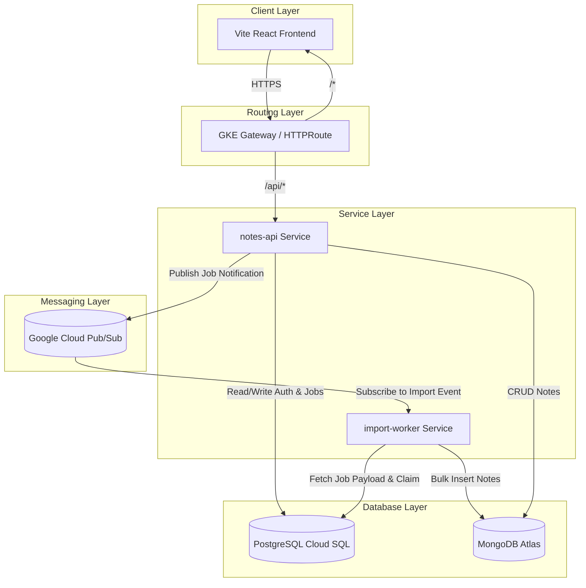
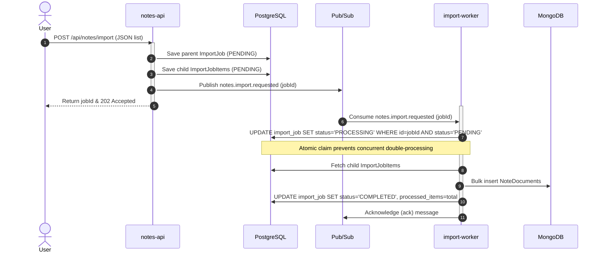

# Document 01: Architecture Design

## 1. System Topology
The application is structured into decoupled components to isolate failure domains and enable independent scaling.

---

## 2. Ingestion Sequence Flow
Below is the sequence flow for an asynchronous bulk import task.

---

## 3. Architectural Decision Records (ADRs)

### ADR 01: Decoupling Bulk Note Ingest
* **Status**: Approved
* **Context**: Bulk importing notes can result in large payloads and heavy database write volume. Processing these synchronously within the API gateway request thread blocks the HTTP thread pool, degrades API responsiveness, and risks thread exhaustion.
* **Decision**: We use an asynchronous ingest pattern. The API persists the payload to PostgreSQL as raw child job records and publishes a lightweight event (containing only IDs) to GCP Pub/Sub. A standalone worker service consumes the queue.
* **Consequences**:
  * API requests return immediately with `202 Accepted`.
  * Failure to write to MongoDB does not block the front-end user session.
  * Worker capacity can be scaled up/down independently of the API gateway.

### ADR 02: Dual Database Strategy (Polyglot Persistence)
* **Status**: Approved
* **Context**: User auth and job metadata require relational constraints, transaction isolation (ACID), and schema enforcement. Notes, however, are document-oriented, have high write/read volumes, and could eventually expand to include unstructured data (such as AI summarization metadata).
* **Decision**: We store user profiles and import jobs in PostgreSQL (Cloud SQL). We store note text collections in MongoDB (Atlas).
* **Consequences**:
  * Prevents bloating the relational database with document contents.
  * Enables fast horizontal scale for note collections while maintaining transactional safety for auth records.
