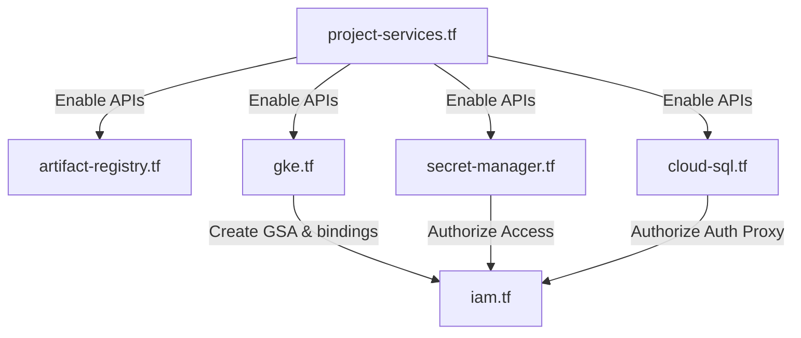

# Document 03: GCP Infrastructure Deployment (IaC)

This document describes how the essential GCP cloud resources are modeled and provisioned using Terraform.

---

## 1. Directory Structure

The Terraform codebase resides in `infrastructure/terraform/` and is divided logically by concerns:
* `versions.tf` / `providers.tf`: Declares providers (google, google-beta) and required versions.
* `variables.tf` / `environments/dev.tfvars`: Environment variables and configurations.
* `project-services.tf`: Enables required APIs (Compute, Container, SQL, Secrets, Pub/Sub, IAM).
* `artifact-registry.tf`: Sets up the docker image repository.
* `gke.tf`: Creates the GKE Autopilot cluster.
* `cloud-sql.tf`: Provisions the PostgreSQL instance, databases, and users.
* `secret-manager.tf`: Creates Secret Manager keys for sensitive credentials.
* `iam.tf`: Sets up the Google Service Accounts (GSA) and Workload Identity bindings.
* `outputs.tf`: Outputs endpoints, registry URLs, and connection names.

---

## 2. Resource Dependency Ordering



---

## 3. Provisioning Steps

To bring up the entire cloud infrastructure from scratch:

1. **Authentication**: Authenticate with the GCP CLI:
   ```bash
   gcloud auth login
   gcloud auth application-default login
   ```
2. **Configuration**: Edit `infrastructure/terraform/environments/dev.tfvars` with your target `project_id` and region values.
3. **Execution**: Initialize and apply the configuration:
   ```bash
   cd infrastructure/terraform
   terraform init
   terraform plan -var-file=environments/dev.tfvars
   terraform apply -var-file=environments/dev.tfvars
   ```
4. **Outcome**: The outputs will display the registry URL (`artifact_registry_repo`) and the GKE cluster name (`gke_cluster_name`) to be used in the deployment phases.

---

## 4. Teardown and Cost Management

To avoid ongoing charges when testing is completed:

1. **Destroy GKE Cluster Only**:
   ```bash
   cd infrastructure/terraform
   terraform destroy -target="google_container_cluster.primary" -var-file="environments/dev.tfvars"
   ```
   *(Note: `deletion_protection = false` is configured in `gke.tf` to permit automated destruction).*

2. **Full Infrastructure Destruction**:
   ```bash
   cd infrastructure/terraform
   terraform destroy -var-file="environments/dev.tfvars"
   ```

