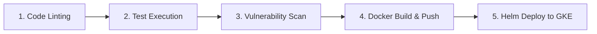

# Document 05: CI/CD Ingestion Pipelines

This document outlines the design of the planned CI/CD automation pipeline for building, scanning, and deploying CloudNotes.

---

## 1. Pipeline Architecture

The pipeline will run on **GitHub Actions** and execute the following stages on every commit to `main`:



---

## 2. CI/CD Details

### Stage 1: Lint & Code Style
* Run `./gradlew checkstyle` on Java projects.
* Run `npm run lint` on the Vite React project.

### Stage 2: Unit & Integration Testing
* Runs all JUnit/Spring Boot tests inside the isolated runner environment.
* Spins up test containers (Postgres, MongoDB) using GitHub Actions services.

### Stage 3: Vulnerability Scanning
* Scans third-party dependencies for CVE vulnerabilities (using Trivy or Dependency Check).
* Rejects builds containing high or critical issues.

### Stage 4: Build & Publish
* Authenticates with Google Cloud using short-lived credentials via OpenID Connect (OIDC) Workload Identity Federation (no static long-lived credentials).
* Builds Docker images using the project's multi-stage Dockerfiles.
* Tags images using the unique Git Commit SHA (`REGION-docker.pkg.dev/PROJECT/cloudnotes/backend:<git-sha>`).
* Pushes the built layers to GCP Artifact Registry.

### Stage 5: GKE Rolling Update
* Configures `kubectl` access for the GKE cluster.
* Runs `helm upgrade --install` with the new commit tag passed as a variable:
  ```bash
  helm upgrade --install cloudnotes ./infrastructure/helm/cloudnotes \
    --set backend.image.tag=${GITHUB_SHA::7} \
    --set importWorker.image.tag=${GITHUB_SHA::7} \
    --set frontend.image.tag=${GITHUB_SHA::7}
  ```
