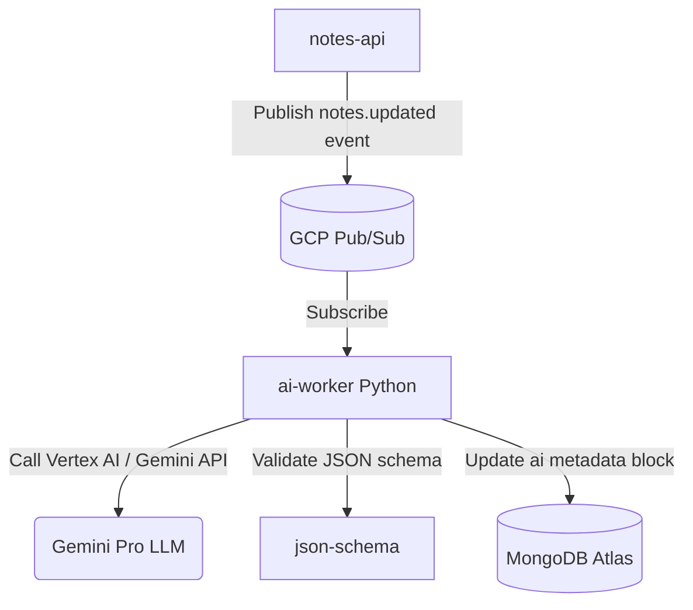

# Document 07: AI Summarization Worker Design

This document details the planned integration of artificial intelligence summarization capabilities in Phase 6.

---

## 1. Asynchronous AI summarization Flow

When a user saves or updates a note, an event is triggered to request AI summarization.



---

## 2. Component Design

### A. Python Worker
* **Language & Framework**: Python 3.11 with `google-cloud-pubsub` and `google-generativeai` SDK.
* **Why Python?**: Standardized libraries for data science, JSON Schema validation, and LLM integrations.

### B. Prompt Constraint Strategy
To guarantee that the model outputs structured content instead of arbitrary text:
* We configure **Structured Outputs** on the Gemini API by passing a JSON Schema.
* Model Prompt:
  ```text
  You are an expert note summarizer. Summarize the following note text.
  Analyze the key points, auto-categorize into topics, and return the output matching the requested JSON schema.
  ```
* Schema Constraint:
  ```json
  {
    "type": "object",
    "properties": {
      "summary": { "type": "string" },
      "topics": { "type": "array", "items": { "type": "string" } },
      "sentiment": { "type": "string", "enum": ["POSITIVE", "NEUTRAL", "NEGATIVE"] }
    },
    "required": ["summary", "topics", "sentiment"]
  }
  ```

### C. Persistent Storage
The summarization outputs are stored directly inside the note document in MongoDB under a nested `ai` block:
```json
{
  "_id": "uuid-here",
  "title": "Ingestion Design",
  "content": "...",
  "ai": {
    "summary": "Notes on async ingestion architecture.",
    "topics": ["system-design", "kubernetes"],
    "sentiment": "NEUTRAL",
    "model": "gemini-1.5-flash",
    "updatedAt": "2026-07-16T22:41:00Z"
  }
}
```
This avoids relational joins and allows the React client to render AI tags and summary cards directly alongside the note editor.
